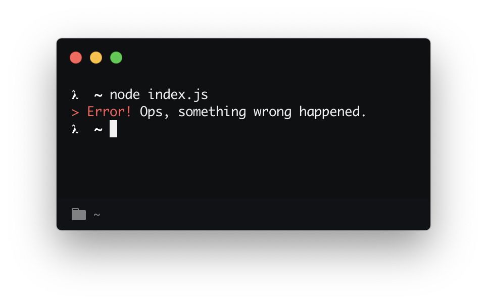

# shout-error [](https://travis-ci.org/bukinoshita/shout-error)

> An opinionated error message



## Install

```
$ yarn add shout-error
```

## Usage

```js
const { shoutError } = require('shout-error')

const error = new TypeError('Ops, something wrong happened')

shoutError(error)
```

_Uses [chalk](https://github.com/chalk/chalk), will return a error message with a nice color._

## API

### shoutError(message, label)

#### message

Type: `string` or [`instanceof Error`](https://developer.mozilla.org/en-US/docs/Web/JavaScript/Reference/Global_Objects/Error) or [`instanceof TypeError`](https://developer.mozilla.org/en-US/docs/Web/JavaScript/Reference/Global_Objects/TypeError)<br>
Required

#### label

Type: `string`<br>
Default: `> Error!`

## Related

- [shout-message](https://github.com/bukinoshita/shout-message) — An opinionated message
- [shout-success](https://github.com/bukinoshita/shout-success) — An opinionated success message

## License

MIT © [Bu Kinoshita](https://bukinoshita.com)
